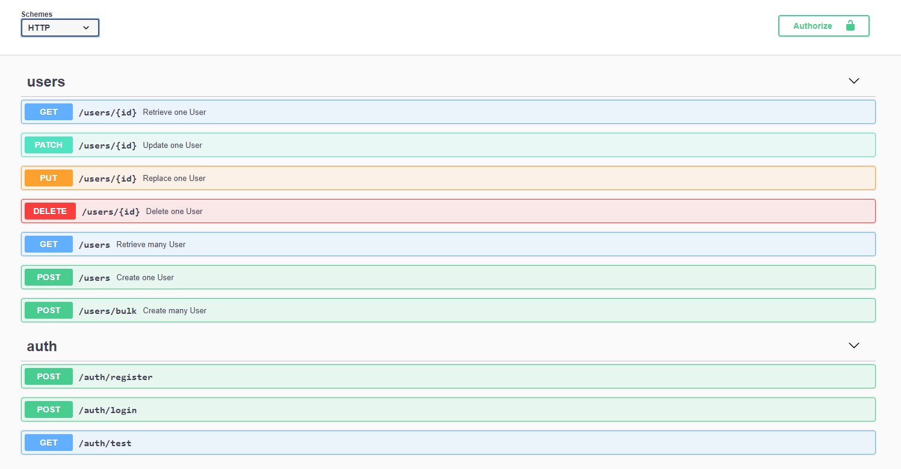

# BitSeer

[GitHub Repository](https://github.com/LuyCki/bitSeer-Startup)

A personal project that one day will become my software development startup.

For now, it's just the presentation layer `(UI)` and the server that handle the `Authentication`, `Authorization`, and `Encryption` and will `easy support` adding future features.

----------

## High Level Documentation

Sources / technologies:
- [Javascript](https://www.javascript.com/)
- [TypeScript](https://www.typescriptlang.org/docs/home.html)
- [Node](https://nodejs.org/en/)
- [RxJS](https://rxjs-dev.firebaseapp.com/)

Technologies / dependencies client side:
- [Angular](https://angular.io/docs)
- [Bootstrap](https://getbootstrap.com/docs/4.5/getting-started/introduction/)

Technologies / dependencies server side:
- [Nest](https://nestjs.com/)
- [MySql](https://www.mysql.com/)
- [Swagger](https://swagger.io/)
- [Typeorm](https://typeorm.io/#/)
- [Passport](http://www.passportjs.org/)
- [BCrypt](https://www.npmjs.com/package/bcrypt)

*For all dependencies and their version check package.json from bitSeerClient / bitSeerServer directory*

----------

### Key features 

- The communication client-server is based on representational state transfer `(REST)` that implement an `RESTful AIP`

- This applications uses JSON Web Token (JWT) to handle authentication. The token is passed with each request using the `Authorization` header with `Token` scheme. The JWT authentication middleware handles the validation and authentication of the token.

- Using `bcrypt` for password hashing

- Using `Swagger` for design, build, document and consume `RESTful web services`

- and more others... 

----------

### How to start ?

You need to install:
- [Node](https://nodejs.org/en/)
- [MySql Database](https://www.mysql.com/downloads/)
- [Git](https://git-scm.com/)

> Yes, that's all! The other dependencies will be installed by `Node Package Manager` on each project respectively bitSeerClient and bitSeerServer.

It's time to clone the repository if you didn't do this earlier. Run:

    git clone https://github.com/LuyCki/bitSeer-Startup.git

Now, you need to follow:

[Server Side Documentation](./bitSeerServer/README.md)

[Client Side Documentation](./bitSeerClient/README.md)

----------

### More images, enjoy!

`Swagger AIP Documentation`

`What We Offer`

